# 📋 USE CASES - NT208 HOTEL MANAGEMENT SYSTEM

## 🎭 CÁC TÁC NHÂN (ACTORS)

### 1. **Customer (Khách hàng)**
- **Mô tả**: Người dùng đã đăng ký tài khoản để tìm kiếm và đặt phòng khách sạn
- **Quyền hạn**: Đặt phòng, quản lý booking, đánh giá khách sạn, quản lý profile

### 2. **Guest (Khách vãng lai)**
- **Mô tả**: Người dùng chưa đăng ký nhưng muốn đặt phòng
- **Quyền hạn**: Tìm kiếm khách sạn, đặt phòng guest, xem thông tin cơ bản

### 3. **Hotel Manager (Quản lý khách sạn)**
- **Mô tả**: Nhân viên quản lý một hoặc nhiều khách sạn cụ thể
- **Quyền hạn**: Quản lý khách sạn được phân công, xem booking, quản lý phòng và dịch vụ

### 4. **Admin (Quản trị viên hệ thống)**
- **Mô tả**: Người có toàn quyền quản lý hệ thống
- **Quyền hạn**: Quản lý tất cả dữ liệu, user, cấu hình hệ thống, báo cáo tổng hợp

## 🔄 USE CASE DIAGRAM

```mermaid
graph TB
    subgraph "NT208 Hotel Management System"
        UC1[Đăng ký/Đăng nhập]
        UC2[Tìm kiếm khách sạn]
        UC3[Đặt phòng]
        UC4[Quản lý booking]
        UC5[Đánh giá khách sạn]
        UC6[Quản lý profile]
        UC7[Đặt phòng guest]
        UC8[Quản lý khách sạn]
        UC9[Quản lý phòng]
        UC10[Quản lý dịch vụ]
        UC11[Xem báo cáo khách sạn]
        UC12[Phản hồi đánh giá]
        UC13[Quản lý người dùng]
        UC14[Quản lý hệ thống]
        UC15[Xem báo cáo tổng hợp]
        UC16[Cấu hình hệ thống]
        UC17[Thanh toán]
        UC18[Quản lý khuyến mãi]
    end
    
    Customer[👤 Customer<br/>Khách hàng] --> UC1
    Customer --> UC2
    Customer --> UC3
    Customer --> UC4
    Customer --> UC5
    Customer --> UC6
    Customer --> UC17
    
    Guest[👥 Guest<br/>Khách vãng lai] --> UC2
    Guest --> UC7
    Guest --> UC17
    
    HotelManager[🏨 Hotel Manager<br/>Quản lý KS] --> UC1
    HotelManager --> UC8
    HotelManager --> UC9
    HotelManager --> UC10
    HotelManager --> UC11
    HotelManager --> UC12
    HotelManager --> UC18
    
    Admin[⚡ Admin<br/>Quản trị viên] --> UC1
    Admin --> UC13
    Admin --> UC14
    Admin --> UC15
    Admin --> UC16
    Admin --> UC8
    Admin --> UC9
    Admin --> UC10
```

## 📝 CHI TIẾT USE CASES

### 🔐 NHÓM AUTHENTICATION & AUTHORIZATION

#### UC1: Đăng ký/Đăng nhập
**Actors**: Customer, Hotel Manager, Admin

**Mô tả**: Người dùng đăng ký tài khoản mới hoặc đăng nhập vào hệ thống

**Luồng chính**:
1. Người dùng truy cập trang đăng nhập
2. Chọn đăng nhập bằng email/password hoặc Google OAuth
3. Hệ thống xác thực thông tin
4. Tạo JWT token và chuyển hướng về dashboard

**Luồng thay thế**:
- **Đăng ký**: Người dùng nhập thông tin cá nhân → Xác thực email → Hoàn thành profile
- **Quên mật khẩu**: Nhập email → Nhận link reset → Đặt mật khẩu mới
- **Google OAuth**: Click Google Login → Authorize → Auto tạo/login account

**Preconditions**: Không có
**Postconditions**: Người dùng được xác thực và có session hợp lệ

---

### 🏨 NHÓM HOTEL MANAGEMENT  

#### UC2: Tìm kiếm khách sạn
**Actors**: Customer, Guest

**Mô tả**: Tìm kiếm khách sạn theo tiêu chí như ngày, địa điểm, số khách

**Luồng chính**:
1. Người dùng nhập tiêu chí tìm kiếm (ngày nhận/trả phòng, số khách, địa điểm)
2. Hệ thống hiển thị danh sách khách sạn phù hợp
3. Người dùng có thể lọc theo giá, hạng sao, tiện nghi
4. Xem chi tiết khách sạn với hình ảnh, mô tả, bản đồ

**Luồng thay thế**:
- **Tìm kiếm nâng cao**: Lọc theo loại phòng, dịch vụ cụ thể
- **Tìm kiếm theo vị trí**: Sử dụng GPS để tìm khách sạn gần nhất
- **Không có kết quả**: Gợi ý mở rộng tiêu chí tìm kiếm

**Preconditions**: Không có
**Postconditions**: Danh sách khách sạn được hiển thị

#### UC8: Quản lý khách sạn
**Actors**: Hotel Manager, Admin

**Mô tả**: Thêm, sửa, xóa thông tin khách sạn

**Luồng chính**:
1. Manager/Admin truy cập trang quản lý khách sạn
2. Chọn thêm khách sạn mới hoặc chỉnh sửa khách sạn hiện có
3. Nhập/cập nhật thông tin: tên, địa chỉ, mô tả, hình ảnh
4. Hệ thống geocoding địa chỉ thành tọa độ GPS
5. Lưu thông tin vào database

**Luồng thay thế**:
- **Upload hình ảnh**: Chọn multiple files → Resize → Lưu vào storage
- **Cập nhật vị trí**: Kéo thả marker trên Google Maps
- **Vô hiệu hóa khách sạn**: Soft delete thay vì hard delete

**Preconditions**: Đã đăng nhập với quyền Manager/Admin
**Postconditions**: Thông tin khách sạn được cập nhật

---

### 📅 NHÓM BOOKING MANAGEMENT

#### UC3: Đặt phòng
**Actors**: Customer

**Mô tả**: Đặt phòng khách sạn qua 4 bước

**Luồng chính**:
1. **Bước 1**: Tìm kiếm phòng (ngày, số khách)
2. **Bước 2**: Chọn loại phòng và cấu hình giường
3. **Bước 3**: Nhập thông tin khách và chọn phương thức thanh toán
4. **Bước 4**: Xác nhận booking và thanh toán

**Luồng thay thế**:
- **Room hold**: Hệ thống giữ phòng 15 phút cho user
- **Thêm dịch vụ**: Chọn spa, đưa đón, nhà hàng
- **Áp dụng khuyến mãi**: Nhập mã giảm giá

**Preconditions**: Customer đã đăng nhập và hoàn thành profile
**Postconditions**: Booking được tạo, email xác nhận được gửi

#### UC7: Đặt phòng guest
**Actors**: Guest

**Mô tả**: Khách vãng lai đặt phòng không cần đăng ký

**Luồng chính**:
1. Guest tìm kiếm và chọn phòng
2. Nhập thông tin cá nhân (tên, email, SDT, CCCD)
3. Chọn phương thức thanh toán
4. Xác nhận và thanh toán

**Luồng thay thế**:
- **Tạo tài khoản**: Guest có thể chọn tạo account sau khi đặt
- **Lưu thông tin**: Lưu guest info vào bảng Guests

**Preconditions**: Không có
**Postconditions**: Guest booking được tạo

#### UC4: Quản lý booking
**Actors**: Customer, Hotel Manager, Admin

**Mô tả**: Xem, chỉnh sửa, hủy các booking

**Luồng chính**:
1. Truy cập danh sách booking
2. Xem chi tiết booking (ngày, phòng, dịch vụ, tổng tiền)
3. Thực hiện hành động: hủy, chỉnh sửa, check-in/out

**Luồng thay thế**:
- **Hủy booking**: Tính phí hủy theo policy → Hoàn tiền
- **Thay đổi ngày**: Kiểm tra availability → Cập nhật giá
- **Check-in/Check-out**: Scan QR code hoặc manual

**Preconditions**: Có booking tồn tại
**Postconditions**: Trạng thái booking được cập nhật

---

### ⭐ NHÓM REVIEW & RATING

#### UC5: Đánh giá khách sạn
**Actors**: Customer

**Mô tả**: Khách hàng đánh giá và nhận xét khách sạn đã ở

**Luồng chính**:
1. Customer truy cập booking history
2. Chọn booking đã hoàn thành để đánh giá
3. Cho điểm từ 1-5 sao và viết nhận xét
4. Upload hình ảnh (optional)
5. Submit đánh giá

**Luồng thay thế**:
- **Chỉnh sửa đánh giá**: Trong vòng 7 ngày sau khi đăng
- **Báo cáo đánh giá**: Nếu đánh giá không phù hợp

**Preconditions**: Customer đã check-out
**Postconditions**: Đánh giá được lưu và hiển thị

#### UC12: Phản hồi đánh giá
**Actors**: Hotel Manager

**Mô tả**: Manager phản hồi đánh giá của khách hàng

**Luồng chính**:
1. Manager xem danh sách đánh giá cho khách sạn
2. Chọn đánh giá để phản hồi
3. Viết phản hồi chuyên nghiệp
4. Publish phản hồi

**Preconditions**: Có đánh giá từ khách hàng
**Postconditions**: Phản hồi được hiển thị dưới đánh giá

---

### 💰 NHÓM PAYMENT & BILLING

#### UC17: Thanh toán
**Actors**: Customer, Guest

**Mô tả**: Xử lý thanh toán cho booking

**Luồng chính**:
1. Chọn phương thức thanh toán (tiền mặt, chuyển khoản, thẻ)
2. Nhập thông tin thanh toán
3. Xác nhận số tiền và điều khoản
4. Xử lý payment
5. Tạo hóa đơn và gửi email

**Luồng thay thế**:
- **Thanh toán trước**: Thanh toán toàn bộ hoặc đặt cọc
- **Thanh toán tại khách sạn**: Chỉ đặt chỗ, thanh toán khi check-in
- **Payment failed**: Retry hoặc chọn phương thức khác

**Preconditions**: Có booking hợp lệ
**Postconditions**: Payment được xử lý, hóa đơn được tạo

---

### 👤 NHÓM USER MANAGEMENT

#### UC6: Quản lý profile
**Actors**: Customer, Hotel Manager, Admin

**Mô tả**: Cập nhật thông tin cá nhân

**Luồng chính**:
1. Truy cập trang profile
2. Cập nhật thông tin: tên, SDT, ngày sinh, CCCD
3. Thay đổi mật khẩu (optional)
4. Upload avatar (optional)
5. Lưu thay đổi

**Luồng thay thế**:
- **Xác thực CCCD**: Upload ảnh CCCD để verify
- **Liên kết Google**: Link/unlink Google account

**Preconditions**: Đã đăng nhập
**Postconditions**: Profile được cập nhật

#### UC13: Quản lý người dùng
**Actors**: Admin

**Mô tả**: Admin quản lý tất cả người dùng trong hệ thống

**Luồng chính**:
1. Admin truy cập user management panel
2. Xem danh sách user với filter và search
3. Thực hiện hành động: activate/deactivate, edit, delete
4. Phân quyền cho user

**Luồng thay thế**:
- **Tạo user mới**: Admin tạo account cho staff
- **Reset password**: Reset password cho user
- **View user activity**: Xem lịch sử hoạt động

**Preconditions**: Đã đăng nhập với quyền Admin
**Postconditions**: User data được cập nhật

---

### 🏨 NHÓM ROOM & SERVICE MANAGEMENT

#### UC9: Quản lý phòng
**Actors**: Hotel Manager, Admin

**Mô tả**: Quản lý loại phòng và phòng cụ thể

**Luồng chính**:
1. Truy cập room management
2. Quản lý room types: tạo/sửa/xóa loại phòng
3. Cấu hình giường: đôi/đơn combinations
4. Set giá theo mùa và ngày đặc biệt
5. Quản lý phòng cụ thể: số phòng, tầng, trạng thái

**Luồng thay thế**:
- **Bulk operations**: Cập nhật hàng loạt phòng
- **Maintenance mode**: Đặt phòng vào chế độ bảo trì
- **Dynamic pricing**: Giá tự động theo demand

**Preconditions**: Quyền Manager/Admin
**Postconditions**: Room data được cập nhật

#### UC10: Quản lý dịch vụ
**Actors**: Hotel Manager, Admin

**Mô tả**: Quản lý các dịch vụ khách sạn

**Luồng chính**:
1. Truy cập service management
2. Tạo/cập nhật loại dịch vụ: spa, restaurant, laundry
3. Set giá và mô tả dịch vụ
4. Cấu hình availability và capacity

**Preconditions**: Quyền Manager/Admin
**Postconditions**: Service data được cập nhật

---

### 📊 NHÓM REPORTING & ANALYTICS

#### UC11: Xem báo cáo khách sạn
**Actors**: Hotel Manager

**Mô tả**: Manager xem báo cáo cho khách sạn được quản lý

**Luồng chính**:
1. Truy cập dashboard
2. Chọn khách sạn và khoảng thời gian
3. Xem các metrics: occupancy rate, revenue, bookings
4. Export báo cáo PDF/Excel

**Preconditions**: Có quyền Manager
**Postconditions**: Báo cáo được hiển thị

#### UC15: Xem báo cáo tổng hợp
**Actors**: Admin

**Mô tả**: Admin xem báo cáo toàn hệ thống

**Luồng chính**:
1. Truy cập admin dashboard
2. Xem overview metrics toàn hệ thống
3. Drill down theo khách sạn, thời gian
4. Phân tích trends và performance

**Preconditions**: Quyền Admin
**Postconditions**: System-wide insights được hiển thị

---

### ⚙️ NHÓM SYSTEM ADMINISTRATION

#### UC14: Quản lý hệ thống
**Actors**: Admin

**Mô tả**: Admin quản lý cấu hình và vận hành hệ thống

**Luồng chính**:
1. Truy cập system settings
2. Cấu hình email templates
3. Quản lý payment gateways
4. Set system parameters

**Preconditions**: Quyền Admin
**Postconditions**: System configuration được cập nhật

#### UC16: Cấu hình hệ thống
**Actors**: Admin

**Mô tả**: Cấu hình các tham số hệ thống

**Luồng chính**:
1. Access system configuration
2. Update business rules
3. Configure integrations (Google Maps, Email)
4. Set security policies

**Preconditions**: Quyền Admin
**Postconditions**: System policies được cập nhật

#### UC18: Quản lý khuyến mãi
**Actors**: Hotel Manager, Admin

**Mô tả**: Tạo và quản lý các chương trình khuyến mãi

**Luồng chính**:
1. Truy cập promotion management
2. Tạo mã khuyến mãi với điều kiện
3. Set thời gian hiệu lực
4. Monitor usage và performance

**Luồng thay thế**:
- **Bulk promotion**: Tạo hàng loạt mã cho campaign
- **Conditional promotion**: Khuyến mãi theo điều kiện phức tạp

**Preconditions**: Quyền Manager/Admin
**Postconditions**: Promotion được tạo/cập nhật

## 🔗 QUAN HỆ GIỮA CÁC USE CASES

### Include Relationships:
- UC3 (Đặt phòng) **includes** UC2 (Tìm kiếm khách sạn)
- UC3 (Đặt phòng) **includes** UC17 (Thanh toán)
- UC4 (Quản lý booking) **includes** UC17 (Thanh toán) for cancellation refunds

### Extend Relationships:
- UC7 (Đặt phòng guest) **extends** UC3 (Đặt phòng)
- UC5 (Đánh giá khách sạn) **extends** UC4 (Quản lý booking)

### Generalization:
- UC8, UC9, UC10 đều là specialization của "Hotel Operations Management"
- UC11, UC15 đều là specialization của "Reporting & Analytics"

## 📋 REQUIREMENTS TRACEABILITY

| Use Case | Functional Requirements | Non-Functional Requirements |
|----------|------------------------|---------------------------|
| UC1 | FR001: User Authentication | NFR001: Security, NFR002: Performance |
| UC2 | FR002: Hotel Search | NFR003: Usability, NFR002: Performance |
| UC3 | FR003: Booking Management | NFR004: Reliability, NFR005: Availability |
| UC5 | FR004: Review System | NFR003: Usability |
| UC8 | FR005: Hotel Management | NFR006: Maintainability |
| UC17 | FR006: Payment Processing | NFR001: Security, NFR004: Reliability |

---

## 🎯 BUSINESS VALUE

### Primary Use Cases (High Business Value):
- **UC3**: Đặt phòng - Core business function
- **UC2**: Tìm kiếm khách sạn - Customer acquisition
- **UC17**: Thanh toán - Revenue generation

### Secondary Use Cases (Medium Business Value):
- **UC5**: Đánh giá khách sạn - Customer retention
- **UC8**: Quản lý khách sạn - Operational efficiency
- **UC11/UC15**: Báo cáo - Business intelligence

### Supporting Use Cases (Low Business Value):
- **UC1**: Authentication - Infrastructure requirement
- **UC6**: Quản lý profile - User experience
- **UC14**: Quản lý hệ thống - Administrative function